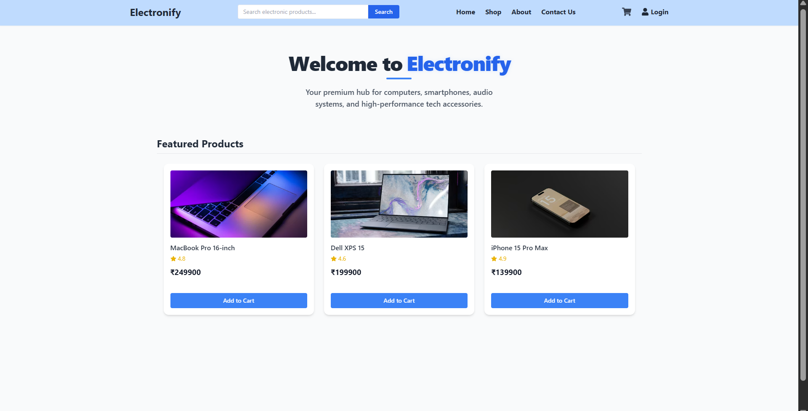
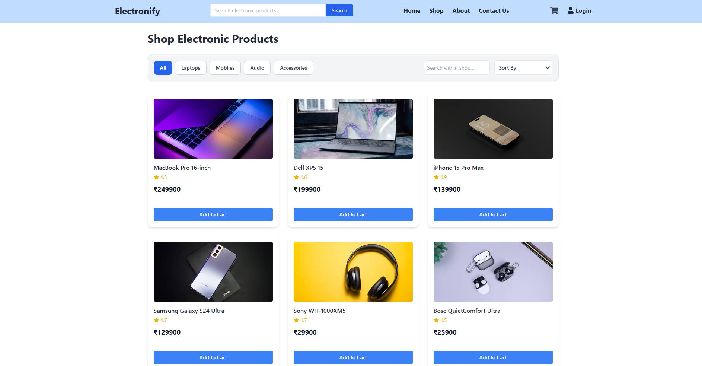

# Electronify (E-commerce website with AI Assistance Bot for customer support)

Electronify,a full-stack E-Commerce electronic product based web application developed using the MERN Stack (MongoDB, Express.js, React.js, and Node.js). This project is designed to provide a smooth shopping experience for customers while also offering a dedicated Warehouse Admin Dashboard for managing products, delivery operations, and customer support.

To enhance user experience, the platform also includes an AI-powered NLP chatbot that helps users by understanding and responding to common customer queries in real time.

## Features

### Customer Side Features
Browse products through a dynamic product catalog with real-time stock updates.
Search and filter products for a faster shopping experience.
Add, update, or remove products from the shopping cart with automatic price calculations.
Place orders easily while inventory updates automatically in the backend.
View order-related activities seamlessly.

### Warehouse Admin Dashboard (WarehouseAdmin Role)
Manage product inventory and update stock details.
Handle driver management operations with full CRUD functionality to track delivery personnel status (Available, Busy, etc.).
Access customer details through a secure registry.
Manage customer support requests and queries efficiently.

### AI-Powered Support Chatbot
The project integrates an intelligent chatbot built using Node-NLP to provide automated customer assistance.

The chatbot can:

1. Understand customer messages using Natural Language Processing (NLP).
2. Identify common intents such as:
refund
payment_issue
login_issue
pricing
technical_problem

3. Generate dynamic responses stored in MongoDB based on confidence scores.
Retrain the NLP model whenever required through backend APIs.

## Tech Stack

### Frontend
React (Vite)	Fast and optimized frontend development
React Router DOM	Client-side navigation
Tailwind CSS	Responsive and modern UI styling
Axios	API requests handling
Context API	Global state management

### Backend
Node.js & Express.js	Backend API and server development
MongoDB & Mongoose	Database management and schema modeling
JWT Authentication	Secure authentication and authorization
Node-NLP	AI chatbot processing and intent recognition

## 📸 Project Screenshots

###  Home Page

### Products

### AI Customer Support Chatbot

### Warehouse Admin Dashboard

## Project Structure
E-Commerce_MERNstack_Project/
│
├── backend/
│   ├── config/          # Database configuration
│   ├── controllers/     # Business logic and route handlers
│   ├── data/            # NLP training data
│   ├── middleware/      # JWT authentication & authorization
│   ├── models/          # MongoDB schemas
│   ├── routes/          # API endpoints
│   ├── services/        # Chatbot logic and NLP services
│   └── server.js        # Backend entry point
│
└── frontend/
    ├── public/          # Static assets
    ├── src/             # Components, pages, contexts
    └── package.json

##  Authentication & Authorization

The application uses JWT (JSON Web Tokens) for secure authentication and role-based authorization.

Roles
Customer – Browse products, place orders, and access chatbot support.
WarehouseAdmin – Manage inventory, drivers, customer data, and support queries.

###  Warehouse Admin Access

To register as a WarehouseAdmin, use the following admin pass key:   admin123

##  Live Demo

🔗 [Visit Electronify Website](https://e-commerce-mer-nstack-project.vercel.app)

